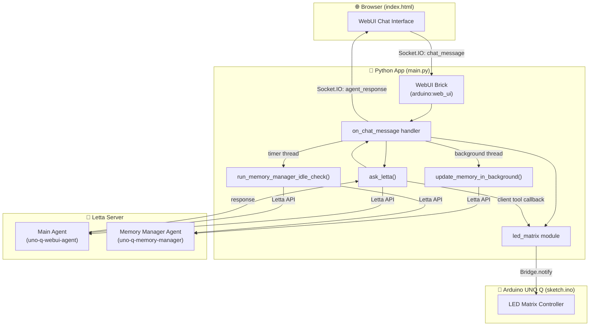
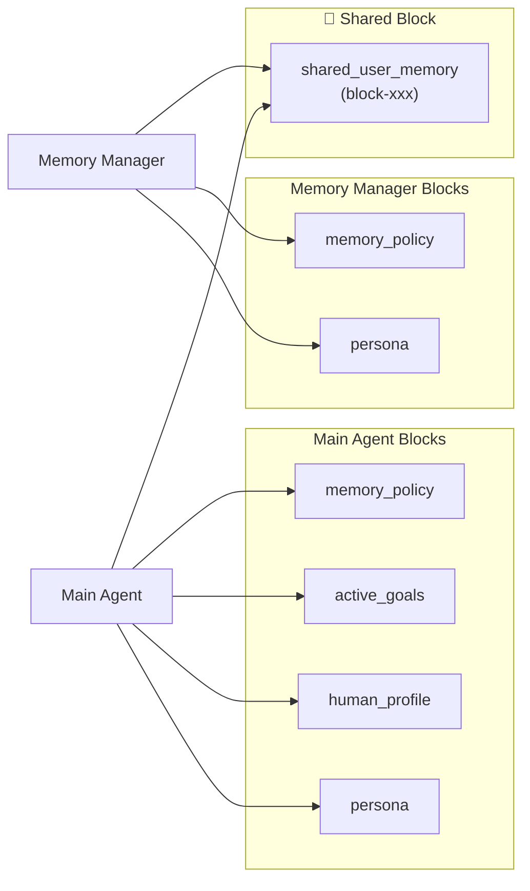
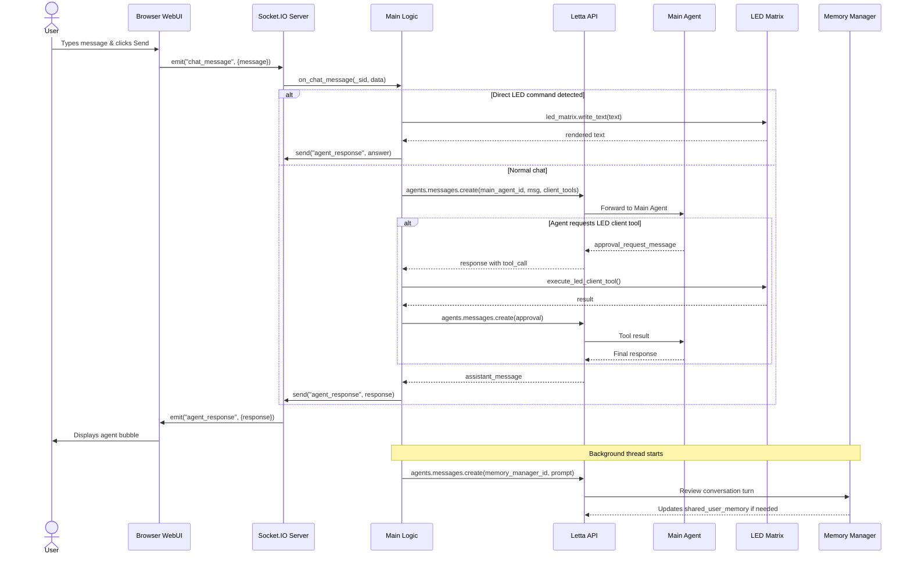
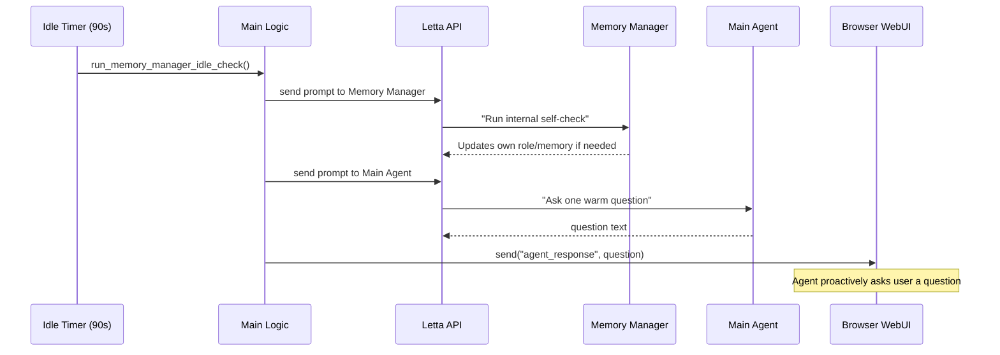
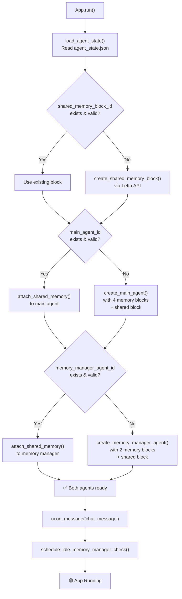
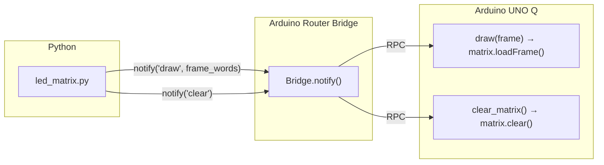

# Drone 03 — App & Block Flow Diagram

## High-Level Architecture

---

## Memory Blocks & Agent Ownership

> [!IMPORTANT]
> Both agents share the **same** `shared_user_memory` block (by `block_id`). Writes from either agent are visible to the other.

---

## Chat Message Flow (step by step)

---

## Idle Self-Check Flow

---

## Startup / Agent Initialization Flow

---

## LED Control Path (Bridge)

---

## File → Component Mapping

| File | Role | Key Components |
|---|---|---|
| [app.yaml](file:///home/haleh/Documents/My%20Projects/letta-local/drone0-03/app.yaml) | App manifest | Declares `arduino:web_ui` brick |
| [main.py](file:///home/haleh/Documents/My%20Projects/letta-local/drone0-03/python/main.py) | Python entry point | Agent lifecycle, chat handler, memory manager, idle timer |
| [config.py](file:///home/haleh/Documents/My%20Projects/letta-local/drone0-03/python/config.py) | Configuration | Letta URL, API key, model, embedding, memory limits |
| [led_matrix.py](file:///home/haleh/Documents/My%20Projects/letta-local/drone0-03/python/led_matrix.py) | LED rendering | 3×5 font, text→pixels→frame, Bridge.notify |
| [index.html](file:///home/haleh/Documents/My%20Projects/letta-local/drone0-03/assets/index.html) | WebUI frontend | Socket.IO chat, message bubbles, status indicator |
| [sketch.ino](file:///home/haleh/Documents/My%20Projects/letta-local/drone0-03/sketch/sketch.ino) | Arduino firmware | Receives `draw`/`clear` via Bridge, drives LED matrix |
